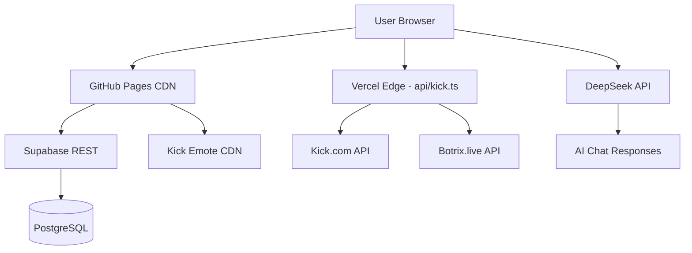

<p align="center">
  
</p>

<h1 align="center">🎮 iABS Stream Hub</h1>

<p align="center">
  <strong>— منصة iABS الشاملة للبث المباشر والتفاعل والمجتمع —</strong>
  <br>
  <em>The Ultimate Streaming Command Center for iABS • Kick • MT RP • Community</em>
</p>

<p align="center">
  
  
  
  
  
  
  
</p>

<p align="center">
  <a href="https://discord.com/users/1416151331965767810">💬 Discord</a> •
  <a href="https://x.com/Moh_HSG">🐦 X (Twitter)</a> •
  <a href="https://github.com/HSG116/iABS_AR">📦 GitHub</a> •
  <a href="https://iabs.stream">🌐 Live Site</a>
</p>

---

## ✨ المميزات — Features

<table>
<tr>
<td width="50%" valign="top">

### 📺 Live Streaming
- **Kick Embed** player with low-latency HLS.js
- Auto-reconnect on stream drop
- Dual-view: featured section + sidebar
- Cinema mode for immersive watching

### 🤖 AI Chat — أبو سعد
- **DeepSeek-powered** with Saudi dialect
- Custom Kick emotes rendering (`[emote:ID]`)
- Social link buttons (`[social:platform:count:url]`)
- **Botrix integration** for leaderboard queries
- 3-key fallback chain for reliability
- Chat logs saved to Supabase

### 📊 Live Social Stats
- Real-time follower counts (Kick, YouTube, TikTok, X, Snapchat, Instagram, Discord, WhatsApp)
- Animated stat cards with platform colors
- Automatic refresh every 60 seconds

</td>
<td width="50%" valign="top">

### 🏆 Botrix Leaderboard
- Top supporters ranked by watchtime
- Level, XP, and points per user
- Profile avatars from Kick API
- Sorted by leaderboard ranking

### 🎬 Media & Content
- **Highlight Clips** gallery (YouTube/TikTok)
- **Studio Section** — community submissions with approve/reject moderation
- **Media Library** — image/video/link assets

### 📋 Community Tools
- **📢 Announcement Bar** — scrolling ticker
- **📅 Stream Schedule** — weekly plan toggle
- **❓ FAQ Section** — expandable Q&A
- **💰 Sponsors & Promo Codes** — one-click copy
- **📊 Live Polls** — real-time voting

### 🔐 Admin Dashboard
- **Full RBAC** — admin/editor/viewer roles
- **SEO Settings** — title, description, keywords
- **Audit Logs** — full activity trail
- **AI Chat Logs** — view all conversations
- **Studio Review** — approve/reject submissions
- **Media Manager** — upload & organize assets

</td>
</tr>
</table>

---

## 🛠 Architecture — البنية التقنية



| Layer | Technology | Purpose |
|-------|-----------|---------|
| **Frontend** | React 19 + TypeScript + Vite 6 | SPA with instant HMR |
| **Styling** | Tailwind CSS (utility-first) | Responsive, dark-theme UI |
| **State** | React hooks + Supabase realtime | Live data without polling |
| **Auth** | Supabase Auth + RBAC | Secure admin access |
| **API Proxy** | Vercel Edge Function | CORS-free fetching |
| **AI** | DeepSeek Chat API | Smart conversational agent |
| **Database** | Supabase PostgreSQL | All dynamic content |
| **Hosting** | GitHub Pages + Vercel | Static + serverless |

---

## 📁 Project Structure — هيكل المشروع

```
iABS_AR/
├── api/                          # Vercel Edge Functions
│   └── kick.ts                   #   Universal API proxy
├── components/
│   ├── AdminDashboard.tsx         #   Full admin panel (10+ tabs)
│   ├── AIChat.tsx                 #   AI assistant with emotes
│   ├── BotrixLeaderboard.tsx      #   Top supporters table
│   ├── StatsSection.tsx           #   Live stats + leaderboard
│   ├── KICKsSection.tsx           #   Stream player embed
│   ├── StudioSection.tsx          #   Community submissions
│   ├── PublicWidgets.tsx          #   Schedule, FAQ, sponsors
│   ├── SocialMediaAdmin.tsx       #   Social count editor
│   └── ...                        #   Icons, utilities & more
├── public/                        # Static assets
│   ├── favicon.png                #   Site icon
│   ├── channels4_banner.jpg       #   YouTube banner
│   └── *.png                      #   Background images
├── App.tsx                        # Main app with routing
├── supabaseClient.ts              # Supabase singleton
├── vite.config.ts                 # Vite + dev proxy config
├── package.json                   # Dependencies & scripts
└── README.md                      # You are here 📍
```

---

## 🚀 Quick Start — التشغيل السريع

### Prerequisites
- **Node.js** 18+ (for Vite & Vercel Edge)
- **npm** 9+
- **Git**

### Installation

```bash
# Clone the repository
git clone https://github.com/HSG116/iABS_AR.git
cd iABS_AR

# Install dependencies
npm install

# Start development server (port 3000)
npm run dev

# Build for production
npm run build

# Preview production build
npm run preview
```

### Deploy to GitHub Pages

```bash
# One command — builds + deploys
npm run deploy
```

---

## 🔧 Configuration — الإعدادات

### Supabase
Edit `supabaseClient.ts`:
```ts
const supabaseUrl = 'https://your-project.supabase.co';
const supabaseKey = 'your-anon-key';
```

### DeepSeek API Keys
Edit `components/AIChat.tsx` — the `API_KEYS` array:
```ts
const API_KEYS = [
  'sk-your-key-1',
  'sk-your-key-2',  // Fallback
  'sk-your-key-3',  // Fallback
];
```

### Social Links
Edit `App.tsx` — `createSocialLink()` function handles:
- Kick, X, Instagram, TikTok, YouTube
- Snapchat, Discord, WhatsApp

### Botrix Leaderboard
The endpoint is configured in `AIChat.tsx`:
```
https://botrix.live/api/public/leaderboard?platform=kick&user=iabs
```

---

## 🎯 Key Components Breakdown

### 🤖 AIChat (`components/AIChat.tsx`)
- **763 lines** of pure React + AI logic
- `renderFormattedText()` — parses `[emote:ID]`, `[social:NAME:COUNT:URL]`, bold/italic markdown
- `sendMessage()` — streaming DeepSeek response with 3-key fallback
- `SYSTEM_PROMPT` — fully customized Saudi personality with few-shot examples
- Logs every conversation to Supabase `ai_chat_logs`

### 📊 StatsSection (`components/StatsSection.tsx`)
- 4 animated stat cards (Kick, YouTube, TikTok, X)
- Live follower count from Supabase `social_links` table
- Renders `BotrixLeaderboard` inline under "Top Gifters"

### 🏆 BotrixLeaderboard (`components/BotrixLeaderboard.tsx`)
- Fetches via Vercel Edge proxy (`/api/kick?endpoint=...`)
- Displays rank, avatar, username, level, watchtime, XP, points
- Batches Kick avatar fetches (5 at a time)

### 🔐 AdminDashboard (`components/AdminDashboard.tsx`)
- 12-tab panel: Overview, Announcements, Sponsors, Clips, Studio Review, Schedule, FAQs, SEO, Admins, Audit, Media, AI Logs
- Supabase CRUD for every content type
- Cartoon-style UI with shadows and gradients

---

## 💾 Database Schema — هيكل قاعدة البيانات

| Table | Purpose |
|-------|---------|
| `social_links` | Platform URLs + follower counts |
| `announcements` | Scrolling ticker + toggles |
| `sponsors` | Brand promo codes |
| `highlight_clips` | Video gallery |
| `schedule` | Weekly stream plan |
| `faqs` | Q&A entries |
| `seo_settings` | Meta tags |
| `polls` | Live voting |
| `admin_users` | RBAC controls |
| `audit_logs` | Activity trail |
| `media_assets` | Image/video/link library |
| `studio_submissions` | Community content |
| `ai_chat_logs` | AI conversation history |
| `daily_views` | Visitor analytics |

---

## 📸 Screenshots — لقطات من الموقع

<p align="center">
  <em>(Coming soon — screenshots of the live site)</em>
</p>

---

## 🤝 Contributing — المساهمة

1. Fork the repository
2. Create a feature branch (`git checkout -b feature/amazing`)
3. Commit your changes (`git commit -m 'Add amazing feature'`)
4. Push to the branch (`git push origin feature/amazing`)
5. Open a Pull Request

### Guidelines
- Follow the existing code style (inline Tailwind, functional components)
- Test with `npm run build` before submitting
- Keep the Saudi dialect in AI prompts authentic
- No Unicode emojis in AI responses — use Kick emotes instead

---

## 📬 Contact — التواصل

| Channel | Info |
|---------|------|
| 📧 **Business Email** | ABSX84@gmail.com |
| 📞 **Phone** | +966 550 348 751 |
| 💬 **Discord** | [Moh_HSG](https://discord.com/users/1416151331965767810) |
| 🐦 **X (Twitter)** | [@Moh_HSG](https://x.com/Moh_HSG) |
| 🎮 **Kick** | [iABS](https://kick.com/iABS) |

---

## 📜 License — الترخيص

```
© 2026 iABS Stream Hub. All Rights Reserved.
Built with ❤️ by HSG for the iABS Community
```

<p align="center">
  <a href="https://discord.com/users/1416151331965767810">
    
  </a>
  <a href="https://x.com/Moh_HSG">
    
  </a>
  <a href="https://github.com/HSG116/iABS_AR">
    
  </a>
</p>

<p align="center">
  <sub>Built with ❤️ by <a href="https://github.com/HSG116"><strong>HSG</strong></a> for the iABS Community</sub>
  <br>
  <sub>🛠️ <a href="https://discord.com/users/1416151331965767810">💬 Join Discord</a> · <a href="https://x.com/Moh_HSG">🐦 Follow on X</a></sub>
</p>
